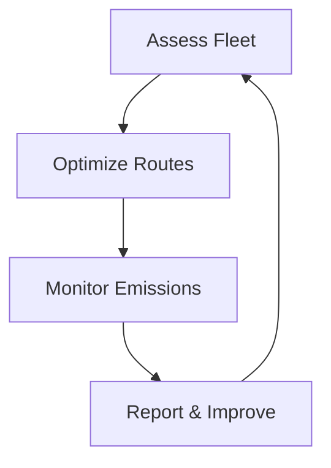

## Overview

You operate within the dynamic St. Lawrence maritime ecosystem, managed by Les Armateurs du Saint-Laurent (ASL). This association unites 14 shipowners transporting goods and passengers across the St. Lawrence River, Great Lakes, Arctic waters, and Maritime provinces. Core concepts drive sustainable growth, regulatory compliance, and operational efficiency. Understand these fundamentals to navigate challenges like ice conditions, environmental regulations, and trade routes effectively.

<Callout kind="info">
ASL provides regulatory watch and strategic advocacy to support your maritime operations.
</Callout>

## St. Lawrence River Ecosystem

The St. Lawrence River forms the backbone of Canadian maritime transport, spanning over `{2,000 km}` from the Atlantic to the Great Lakes. You encounter diverse ecosystems including tidal zones, freshwater ports, and lock systems like those at the Welland Canal.

<Columns cols={3}>
  <Card title="Tidal Influences" icon="waves" href="#">
    Manage `{<6m}` tidal ranges affecting loading schedules.
  </Card>
  <Card title="Lock Navigation" icon="lock" href="#">
    Plan transits through `{15}` Seaway locks.
  </Card>
  <Card title="Port Infrastructure" icon="anchor" href="#">
    Utilize key ports like Quebec City and Montreal.
  </Card>
</Columns>

## Great Lakes and Arctic Routes

Extend your operations to interconnected Great Lakes and challenging Arctic passages. Great Lakes routes handle bulk cargo like grain and iron ore, while Arctic voyages demand ice-class vessels for summer navigation.

<Tabs>
  <Tab title="Great Lakes" icon="globe">
    You traverse Lakes Ontario, Erie, Huron, Michigan, and Superior. Key considerations include `{<10m}` draft limits and winter closures from December to March.
  </Tab>
  <Tab title="Arctic Routes" icon="snowflake">
    Navigate Northwest Passage with polar code compliance. Ice charts from Environment Canada guide `{June-October}` windows.
  </Tab>
</Tabs>

<Expandable title="Route Comparison" default-open="false">
| Route          | Distance (km) | Season Length | Cargo Types          |
|----------------|---------------|---------------|----------------------|
| Great Lakes    | `{1,600}`     | `{9}` months  | Grain, ore, containers|
| Arctic         | `{{1,400}}`   | `{4}` months  | Bulk, fuel, research |
</Expandable>

## Sustainable Development Strategies

ASL promotes eco-friendly practices to balance growth with environmental protection. You implement strategies like fuel efficiency, emissions tracking, and biodiversity monitoring.

<Steps>
  <Step title="Assess Fleet" icon="search">
    Audit vessels for Energy Efficiency Design Index (`EEDI`) compliance.
  </Step>
  <Step title="Optimize Routes" icon="map">
    Use voyage planning software to minimize fuel use.
  </Step>
  <Step title="Monitor Emissions" icon="activity">
    Track CO2 via systems like those from the International Maritime Organization.
  </Step>
  <Step title="Report Progress" icon="file-text">
    Submit annual sustainability reports to ASL.
  </Step>
</Steps>



## Data-Driven Route Analysis

Analyze routes programmatically to enhance decisions. The following examples process shipping data for St. Lawrence operations.

<CodeGroup tabs="Python,JavaScript">
  ```python
  import pandas as pd

  # Sample St. Lawrence route data
  routes = pd.DataFrame({
      'route': ['St. Lawrence', 'Great Lakes', 'Arctic'],
      'distance_km': [2000, 1600, 1400],
      'ice_risk': [0.1, 0.3, 0.8]
  })

  # Calculate risk-adjusted travel time
  routes['travel_days'] = routes['distance_km'] / 300 * (1 + routes['ice_risk'])
  print(routes)
  ```
  ```javascript
  // Sample St. Lawrence route data
  const routes = [
    { route: 'St. Lawrence', distanceKm: 2000, iceRisk: 0.1 },
    { route: 'Great Lakes', distanceKm: 1600, iceRisk: 0.3 },
    { route: 'Arctic', distanceKm: 1400, iceRisk: 0.8 }
  ];

  // Calculate risk-adjusted travel time
  routes.forEach(r => {
    r.travelDays = (r.distanceKm / 300) * (1 + r.iceRisk);
  });
  console.table(routes);
  ```
</CodeGroup>

<Callout kind="tip">
Integrate ASL's regulatory updates into your planning tools for real-time compliance.
</Callout>