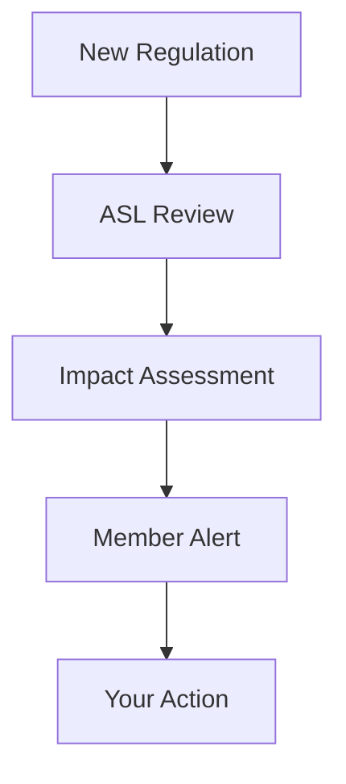

## Overview

Les Armateurs du Saint-Laurent (ASL) represents 14 domestic shipowners operating on the St. Lawrence River, Great Lakes, Arctic, and Maritime provinces. You benefit from ASL's advocacy services that include regulatory monitoring, position-taking with authorities, and stakeholder collaboration. These efforts ensure your interests align with government policies and industry growth.

<Columns cols={3}>
  <Card title="Regulatory Watch" icon="eye" href="#regulatory-monitoring">
    Stay informed on regulations affecting your operations.
  </Card>
  <Card title="Position-Taking" icon="message-square" href="#position-taking">
    ASL voices your concerns to decision-makers.
  </Card>
  <Card title="Stakeholder Links" icon="link" href="#collaboration">
    Build partnerships for mutual success.
  </Card>
</Columns>

## Regulatory Monitoring

ASL provides continuous regulatory watch to keep you ahead of changes. Our team tracks federal, provincial, and international maritime regulations, analyzing impacts on your fleet and cargo operations.

<Callout kind="tip">
  Subscribe to ASL's regulatory alerts to receive timely updates via email.
</Callout>

### How Monitoring Works

<Steps>
  <Step title="Track Legislation" icon="search">
    ASL monitors bills from Transport Canada, Environment Canada, and Fisheries and Oceans Canada.
  </Step>
  <Step title="Impact Analysis" icon="bar-chart">
    Assess effects on shipping routes, emissions standards, and safety protocols.
  </Step>
  <Step title="Member Alerts" icon="bell">
    Distribute summaries with actionable recommendations.
  </Step>
</Steps>

## Position-Taking with Authorities

ASL takes clear positions on your behalf during consultations. You gain amplified representation without individual lobbying costs.

<Tabs>
  <Tab title="Federal Level" icon="government">
    Engage with Transport Canada on icebreaking services and pilotage fees.
  </Tab>
  <Tab title="Provincial Level" icon="map">
    Advocate in Quebec and Ontario for port infrastructure funding.
  </Tab>
  <Tab title="International" icon="globe">
    Coordinate with IMO on Arctic shipping standards.
  </Tab>
</Tabs>

| Authority | Key Issues | ASL Actions |
|-----------|------------|-------------|
| Transport Canada | Safety regulations | Position papers, meetings |
| Environment Canada | Emissions controls | Joint submissions |
| Fisheries and Oceans | Navigation aids | Advocacy campaigns |

## Collaboration with Stakeholders

ASL fosters strategic links with ports, unions, environmental groups, and other associations. You access pooled expertise and joint initiatives.

<ExpandableGroup>
  <Expandable title="Port Authorities" default-open="true">
    Partner with Montreal Port Authority for efficient cargo handling. ASL negotiates tariffs and schedules benefiting all members.
  </Expandable>
  <Expandable title="Environmental NGOs">
    Collaborate on sustainable practices, like ballast water management, to meet green standards proactively.
  </Expandable>
  <Expandable title="Case Study: 2023 Tariff Negotiations">
    ASL united members to secure a 15% reduction in St. Lawrence pilotage fees through collective bargaining.
  </Expandable>
</ExpandableGroup>

<Callout kind="success">
  Contact ASL at info@asl1936.com to discuss your specific representation needs.
</Callout>

These services have supported member growth since 1936, enhancing maritime transport on the St. Lawrence. Join ASL to leverage this network for your operations.